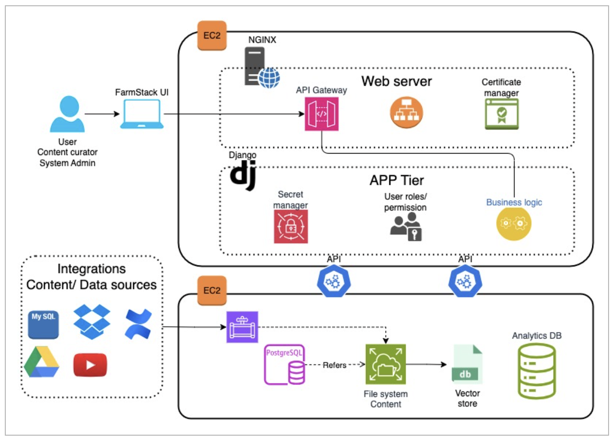
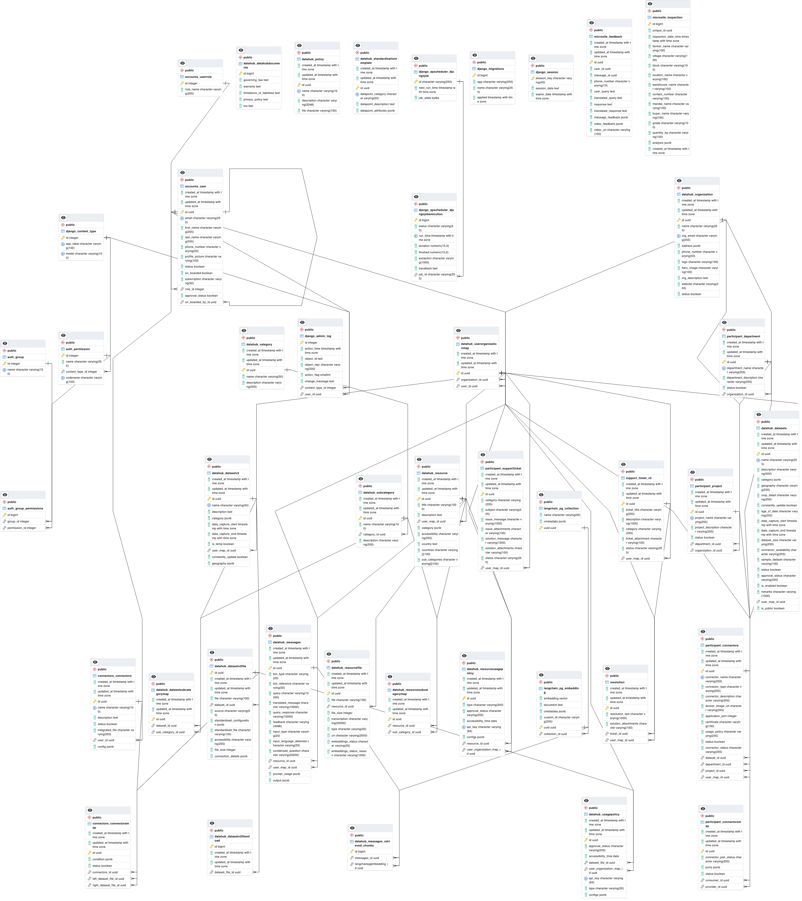
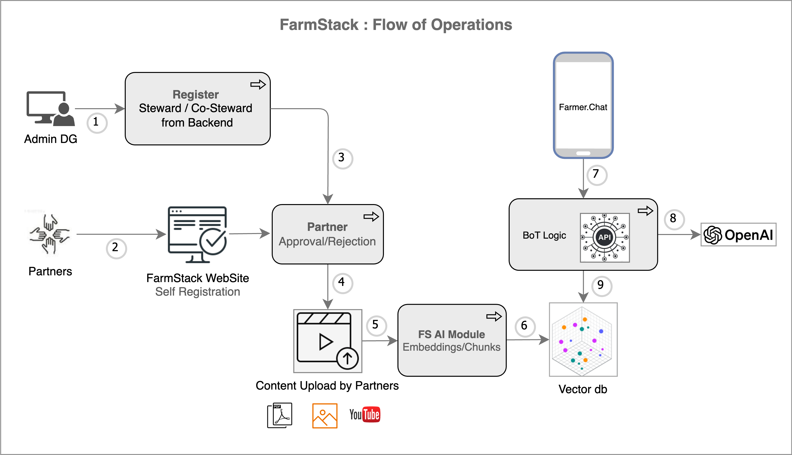

# Introduction

## Overview
Farmers and extension workers are the core of the agricultural ecosystem. Given the complex and diverse nature of agriculture, these individuals face challenges in obtaining reliable and accurate information that is customized to meet their needs. FarmStack helps in addressing these issues. It is a content sharing digital platform developed by DigitalGreen. Here, stakeholders (typically from the 'Agriculture' domain) onboard onto FarmStack to share or exchange data or content. The focus is on smallholder farmers. 

One example use case of FarmStack is integrating it with an AI ChatBot. After uploading the content onto FarmStack (the content can be about farming techniques, weather updates, market prices, etc.), the AI Bot acts as a tool for farmers to get immediate responses to their queries (related to the uploaded content). The 'Artificial Intelligence' needed for the processing of the content at the backend is handled by FarmStack.

Currently, FarmStack is being used in India (Saagu-Baagu project), Ethiopia (DAAS project), and Kenya (KALRO project).

## Document Objective
This document explains FarmStack in the context of the items below:
- Functionalities
- Technology and architecture
- Example use cases

## Audience
This document is intended to be read by technical developers, collaborators, data scientists, product managers, stakeholders in the agricultural ecosystem, academicians, etc.

# Product Description

## Features
- **Stakeholders/Participants**
- **Steward/Co-Steward Governance model**
- **Data/Content exchange platform**
- **Content Management System (CMS)**
- **Content transcriptions, chunking, vector db**
- **Analytical Dashboards**

### Description

#### Stakeholders/Participants
A “Participant” is an organization that joins FarmStack to share and access content, benefiting from the platform’s AI capabilities.

#### Steward/Co-Steward Governance model
The steward acts as an 'Admin' on the FarmStack platform. A steward is an individual or an organization which manages a group of participants/co-stewards. Features like user management, content moderation, and usage policy are managed by the steward. A co-steward is similar to a steward but one step below in hierarchy. It can have its own group of participants.

#### Data/Content exchange platform
FarmStack enables content sharing and exchange between participants. 'Public' data published by participants is accessible to any participant, while 'Private' data requires a request from the interested party and approval from the data owner.

#### Content Management System (CMS)
FarmStack functions as a 'Content Management System', allowing participants to upload their content. It offers all the features typical of a Content Management System and supports various content formats including Excel, text, PDF, Word, Website, API, and YouTube videos/playlists.

#### Content transcriptions, chunks, vector db
For video content, a transcription is generated and divided into AI chunks, which are then embedded and stored in a vector database. These chunks are used by an AI bot to answer queries. The same process applies to PDF files. Vernacular languages are first translated into English before being processed into AI chunks.

#### Analytical Dashboards
This helps to understand the analytics of usage, content, and other insights.

## Product Objectives/Goals

### Objectives
- Content Sharing/Exchange between participants
- Reliable Information Access
- User-Friendly Interface
- Secure Data Management
- Building Customizable applications on top of FarmStack
- Embed AI Engine inside FarmStack to process the content for the AI-enabled services.

### Larger Goals
- Empower smallholder farmers and enhance productivity
- Provide a platform that helps stakeholders to access and share content.
- Seamless integration with front-end applications like Bot, Android app, etc.

# System Architecture

## Architecture Diagram

## Architecture Components

### In EC2 instance-1
- **NGINX**
  - **As a Web Server:** Efficiently serves static content such as HTML, CSS, JavaScript, and images. Handles concurrent connections.
  - **As a Load Balancer:** Distributes incoming application traffic across multiple servers.
  - **As an HTTP Cache:** Caches responses from upstream servers, reducing their load and speeding up content delivery to clients.
  - **For Content Compression:** Compresses responses, reducing the amount of data transferred over the network.
  - **As an API Gateway:** Routes requests from clients to various backend servers.
  - **Runs the Certificate Manager:** Manages SSL/TLS certificates to secure HTTP traffic.
- **Django framework**
  - It is the backbone of FarmStack.

- **Secret Manager:**
  - Handles the 'Secret Manager' which handles sensitive information such as API keys, database passwords, and other confidential data.

### User role/permissions
Roles and permissions are essential components of the authentication and authorization system. They help control access to various parts of the application and manage what different users can do within the system.

### Business logic
Calls necessary APIs to interact with the database.

### In EC2 - Instance-2
This serves as a dedicated database instance with the following functions:
- Runs connectors to integrate and ingest data from various content and data sources, such as MySQL, Google Drive, YouTube, or direct uploads. This content is stored in a local file system and referenced using a PostgreSQL schema, which defines its structure (category, sub-category, tags, location, etc.).
- Converts the local file system into a vector store using an embedding model in the Qdrant vector database.

# Technologies Used
The list of technologies, tools used, and the ‘Folder structure’ of the code bundle are explained in the below document.
- [FS Tech Stack](docs/tech_stack.md)

# System Requirements
Refer to the below link to understand the system requirements.
- [FS_System_Requirements](docs/system_requirements.md)

# Data Models

## Database Schema
The complex database schema is given below.
- 

## Data Flow Diagrams

For the explanation, refer to the User Manual section/document.

# API Specifications
Here is the Postman link explaining the list of APIs used and other details.
- [FS APIs](https://farmstack.postman.co/workspace/Team-Workspace~969c8a4f-ed74-4a62-8242-136e8f19f004/collection/21462346-53d41ee4-4726-42fe-8b41-49b188d8ee1a?action=share&creator=25788189)

# Implementation Details

## Development Environment
The instructions to set up a FarmStack “Development instance” are given here.
- [INSTALLATION_GUIDE_FS_DEV](docs/INSTALLATION_GUIDE.md)

## Production Deployment plan
The document explains the ‘Installation of FarmStack’ instance and setting up of steward and onboarding participants.
- [FS Deployment plan](docs/prod_deployment.md)

# Maintenance and Support

## Issue Tracking
The ‘Issues’ tab in GitHub is a powerful feature designed for tracking tasks, enhancements, and bugs. This is used to track issues reported by developers/testers and collaborators.

## Support Plan
Contact ‘support@digitalgreen.org’ for any questions or clarifications needed.

# Security Considerations

## Security Measures
The current minimum security measures implemented in the FarmStack application are as follows:
- Only registered users with OTP authentication can access FarmStack.
- All API calls are verified using a standard token-based authentication system.

# FAQ/User Manual

## User Guide
This document contains steward, co-steward, and participants operations.
- [FS User Manual](https://docs.google.com/document/d/1RhuRXKB-8AXDzXzIZf9WxokRBrF2hxV-AHZnEzbVq_E/edit?usp=sharing)

## FAQ
Frequently asked questions.
- [FS FAQ Document](https://docs.google.com/document/d/126vALMTYEH68E6Rsz59CdfKeXvqHaJkcu8gnUfwWAQs/edit?usp=sharing)

# Appendices

## Glossary
Definitions of terms used in the document

## License Information
FarmStack is an openly licensed digital solution that adheres to privacy and security standards and is designed to help achieve the United Nations Sustainable Development Goals. FarmStack has been recognized as a Digital Public Good by the Digital Public Goods Alliance. So, anyone can use FarmStack without any license payments.
